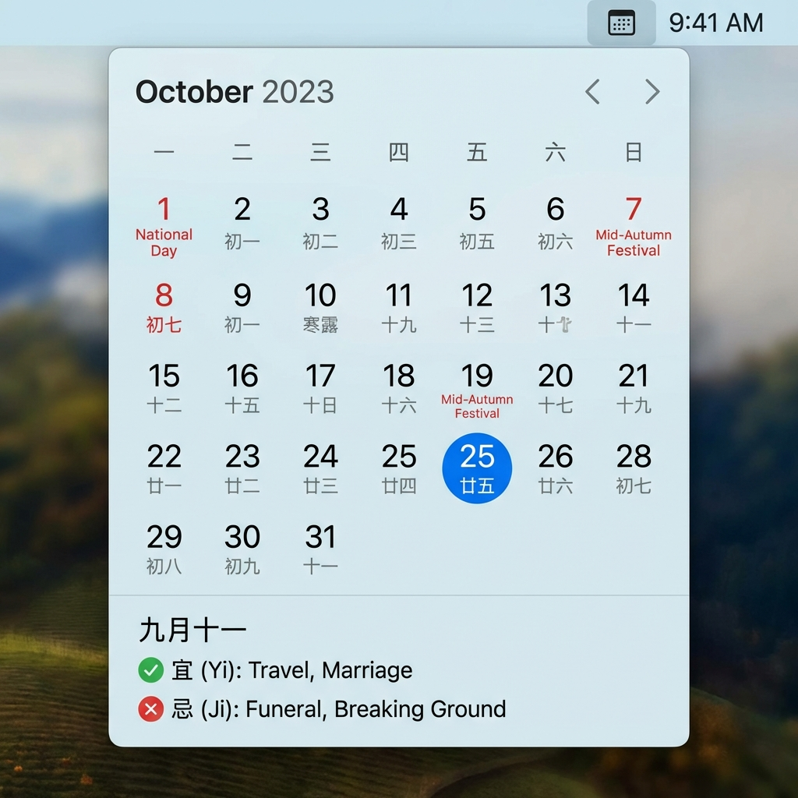

# ZenCalendar 禅历

[中文说明 (Chinese)](README_CN.md)

A minimal, elegant Chinese lunar calendar for the macOS menu bar. Designed with modern frosted glass aesthetics.



## ⚠️ Important: "App is Damaged" Error

Since this app is not notarized by Apple (requires a $99/year subscription), macOS Gatekeeper may block it. If you see a message saying **"ZenCalendar" is damaged and can't be opened**, please follow these steps:

**Option 1: Open via Right-Click (Recommended)**
1. Locate the app in Finder.
2. **Control-click (or Right-click)** the app icon.
3. Select **Open**.
4. Click **Open** in the dialog box.

**Option 2: Terminal Fix (Definitive)**
Run this command in Terminal to remove the quarantine attribute:
```bash
xattr -cr /Applications/禅历.app
```
*(Replace path if your app is located elsewhere)*

---

## Features

- 📅 **Menu Bar Calendar** - Quick access from your menu bar.
- 🌙 **Lunar Calendar** - Full support for Chinese lunar dates.
- 🎉 **Festivals** - Traditional festivals and statutory holidays.
- 🌿 **Solar Terms** - 24 Solar Terms (Jieqi).
- 📖 **Almanac** - Daily Yi (Good for) and Ji (Avoid) recommendations.
- 🎨 **Frosted Glass UI** - Native macOS-like visual effect.

## Requirements

- macOS 13.0+

## Installation

### Download DMG
Download the latest version from [Releases](https://github.com/sannyii/ChineseCalendar/releases).

1. Open the `.dmg` file.
2. Drag **禅历** to the **Applications** folder.
3. **Important:** See the troubleshooting section above if you cannot open it.

### Build from Source

```bash
git clone https://github.com/sannyii/ChineseCalendar.git
cd ChineseCalendar/ZenCalendar
swift build -c release
```

## Usage

- **Click Icon**: Toggle calendar visibility.
- **Click Header**: Open date picker to jump to any month/year.
- **Right-Click Icon**: Quit the application.

## License

MIT License
